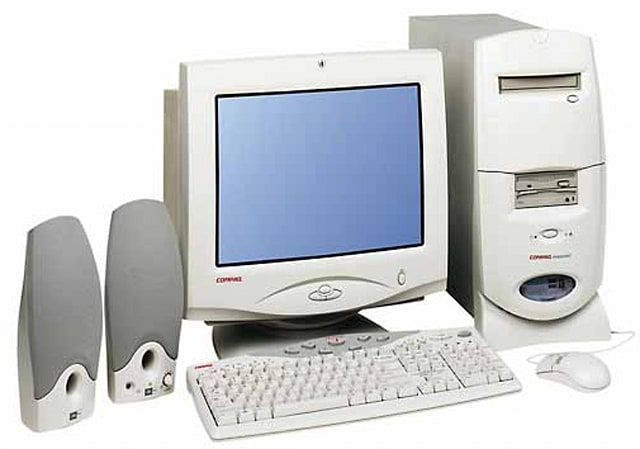

Well, I've been a dev for quite some time now. Although I did feel the urge to write about it sometimes, I never really started something. Here's by dev blog, read through to know a little bit more on how this came to be!

<!-- end -->

## Why a dev blog?

I said I didn't really "started something". I lied. Sorry about that. I do start some things, I just _never really end stuff_. Whenever I feel I have a good grasp of something, I become interested in something else!

However I want to become an expert in some things, namely Blockchain development. The thing is, to become a blockchain developer, you have to be a Full-Stack developer. You have to write things like:

*   Assembly code for things like Ethereum Virtual Machine
*   Native code for node clients like Geth (Go) or Parity (Rust)
*   Backend web services to interact with such nodes, I like to use Node.js but that's just a personal preference
*   Frontend UIs because no one will ever interact with the blockchain via API calls or something

So this seems like a position I enjoy. I'm a jack of all trades, master of none!

### Tell me about you

I'm a weird guy. I've been a geek for a long time, since we got our very first Compaq Presario PC with an amazing DVD player which was **the latest hit on the market**, with whooping 64Mb of RAM and a 8gb HDD. For several times I screwed up formatting the PC and upgrading it, having to leave the PC in perfect working condition for my sister's word processing needs.

Anyway, one of the things I care the most is music, and that's eventually where my life lead me to. I invested thousands of hours of my life with my beautiful cello, and even got to study with some of the best teachers around. I graduated in Music and then became incredibly interested in teaching stuff, so I went down the path of Music Education.

Don't think I stopped being a geek! My OS was always some flavour of Linux (if it was Arch, I would tell you that on the first paragraph). But I never really dived into programming, I didn't even know what exactly was a compiler!

Anyway, I was a teacher for 7 years! Quite far away from my hometown though. It wasn't a very pleasant life given the conditions teachers are offered, but I enjoyed very much those years of dealing with little humans learning music and becoming ready to face the so-called _real life_. My social skills **had** to improve, there was no other way.

Eventually, shortly after getting married, I decided I wanted to learn something new. Why not programming? Yeah, that seems fun. Let's start with C++ with [this amazing website](https://www.learncpp.com/). Then some Javascript, some Docker, some Git, etc. Before I know it, there's this start-up company [BlockBastards](https://blockbastards.io) that is looking for a junior developer just like me? So, I started learning things there, wrote an ecosystem called [QUDO](https://qudo.io) that used some EOSIO blockchain to reward game developers and players. Again, I had to write pretty much everything, from the Smart Contracts to the Frontend and Backend.

Working alone, or in a small team like in a start-up is great but you're never exposed to microservices, agile methodologies, proper good practices, etc. I needed to become part of a bigger project, so I decided to move on. That's where [Mindera](https://mindera.com) comes in. Amazing company, I was very very happy working there! I worked in a legacy project at [Net-A-Porter](https://www.net-a-porter.com) and then at [Burberry](https://burberry.com). SQL, Spring Java, JSP, HTML, SCSS, Node.js, AWS, Docker, you name it. I had a bunch of stuff to learn! Even started learning Go just for fun.

Now I decided to move on, again. At BlockBastards I was building something on top of an existent blockchain. Now I want to become an expert, which means working at the protocol level. I want to learn with the best, and that's where [Polygon Hermez](https://hermez.io/) came in. Can't tell you much about them because I didn't properly started, but it's an amazing project and I'm pretty sure it's really where I want to be and learn, now.

### What will you be writing here?

I have no idea. Don't even expect me to write often. I'm gonna try my best (pinky promise), but to be honest I usually do stuff with such an excitement that I don't screenshot or photograph anything, so I don't get much to show off and I don't have the pacience to do it again and document it in the form of a tutorial.

However, don't expect a lot of technical things. I believe code is not the end, but just a transition between humans and machines. I care much more about what we accomplish with code, and what future does it give us. If I do something that will benefit someone more other than me, be sure I **will** be writing here, for the sake of advancing whatever we are doing here as a species.

### Please give us a meme

