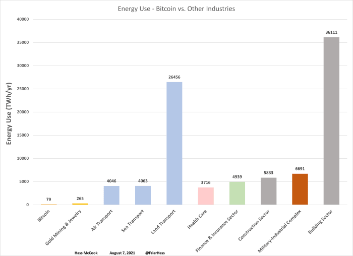
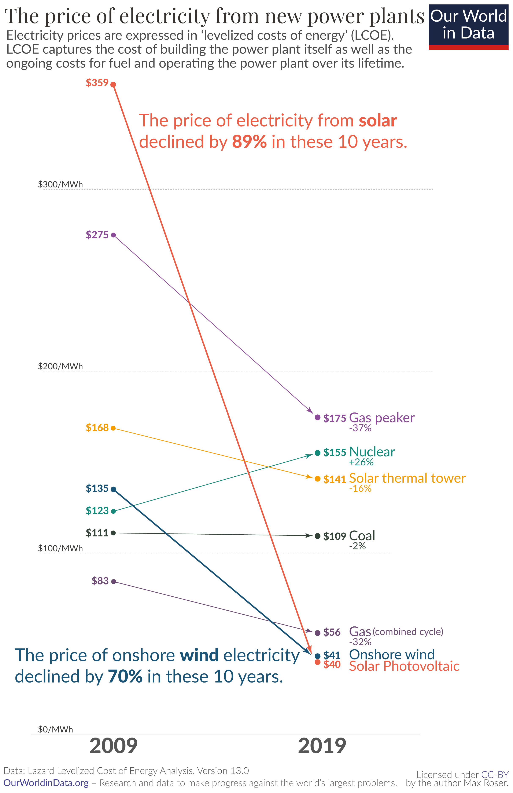

The thing I'm most intrigued about blockchain is the effect it has on human nature. Somehow it brings up all the best in us, but also the worse. However, because it corrects some of our society's biggest flaws, the ultimate effect is positive. Let's talk about energy consumption.

<!-- end -->

# Your money speaks!

When you buy something, you are consuming a product. But more than consuming the product itself, you're consuming a lot of intermediaries. If you buy a smartphone, you're buying not only the product itself, but also the Research and Development (R&D) needed to make you _want_ another phone in a few years. If your phone lasts forever, many companies wouldn't even exist.

Now, I'm not saying I agree with programmed obsolescence. No no, I don't! I hate it, I actually do everything I can to save my phone, my printer, my PC... Because guess what, I don't need a more technologically advanced printer, or a better PC to code, or a better phone for Whatsapp or Reddit. It makes no sense that companies intentionally make you buy _the same thing_ , like the iPhone 13 that's just the iPhone 12 but with a different number. However, some of them want you to buy something that will solve a problem, will represent an evolution.

When the first hybrid cars came in, namely the Toyota Prius, [the guys at Top Gear mocked it](https://youtu.be/xqY8FUDcATE) saying that the manufacturing ecological cost was actually higher than the diesel car. Which was true! However, buying a Prius didn't mean you were simply buying a car, you were actually buying the R&D that Toyota, and others, used to make electric cars. In the very same way, if you buy an electric car today, you're buying the R&D to develop solid state batteries, or cheaper energy.

This is calling _voting with your wallet_, and that's [why you shouldn't buy products from Nestlé](https://skierscribbler.com/7671/opinion/nestle-the-worlds-most-corrupt-corporation/) (long story short: [they killed babies for profit](https://www.businessinsider.com/nestles-infant-formula-scandal-2012-6) )

# Bitcoin energy consumption

Now, to Bitcoin. People say that Bitcoin consumes more energy than Switzerland, which seems like a lot before you consider that pretty much every sector of our economy consumes more energy than Switzerland. This doesn't mean that it's OK, but it means that the comparison doesn't really tell us much:

However, one property of Bitcoin is that it can be mined pretty much anywhere. You can't say the same for most of the other sectors, specially those who have no choice but to rely on fossil fuels, like aviation and construction. For those sectors, you can't choose your energy, and more importantly, can't choose where it comes from. But, by the way, if you buy an electric car you're probably funding the R&D for future eletric planes! 

[If you live in Poland](https://www.bbc.com/news/world-radio-and-tv-17813431), your electric heater runs on coal and there's _nothing you can do about it_ . But guess what, it's not a good country to mine Bitcoin, because fossil fuel is incredibly expensive compared to green energies:

Bitcoin mining is a business that suffers from three big risks:
1. Hardware wear
2. Price fluctuation
3. Energy prices

But mainly... It's all about energy prices. The less you pay for your energy, the more profit there is to be made. That's exactly why most miners are located in places where the energy is incredibly cheap, because... It's either incredibly green, or would be wasted if unused. People have established bitcoin farms in Mongolia, or in Iceland, and even bitcoin farms located somewhere else are most likely using the excess energy at night... So in a way, they're storing the value of that excess energy instead of just letting it go to waste.

Most of all, bitcoin mining is powering the research of new energy sources, and countries like El Salvador are investing quite a lot into getting energy from volcanos, which is not a common source of energy specially for a small, poor country.

Again, take all this with a grain of salt. I'm not saying Bitcoin's power usage is actually a good thing, I'm saying that it will not ruin the environment because ultimately it doesn't use that much energy as it seems. And the R&D it is powering even has the potential to improve the way we use energy for everything else like powering our houses, our cars, our appliances.

The move is certainly towards other consensus protocols, but as I said in my last post, I don't believe Bitcoin will go anywhere in terms of upgradeability, specially in terms of something as crucial as the consensus mechanism. So I guess we'll have to just live with it, while reaping the benefits it has brought us in terms of human rights and fairness. I'll talk about it in a later post.
