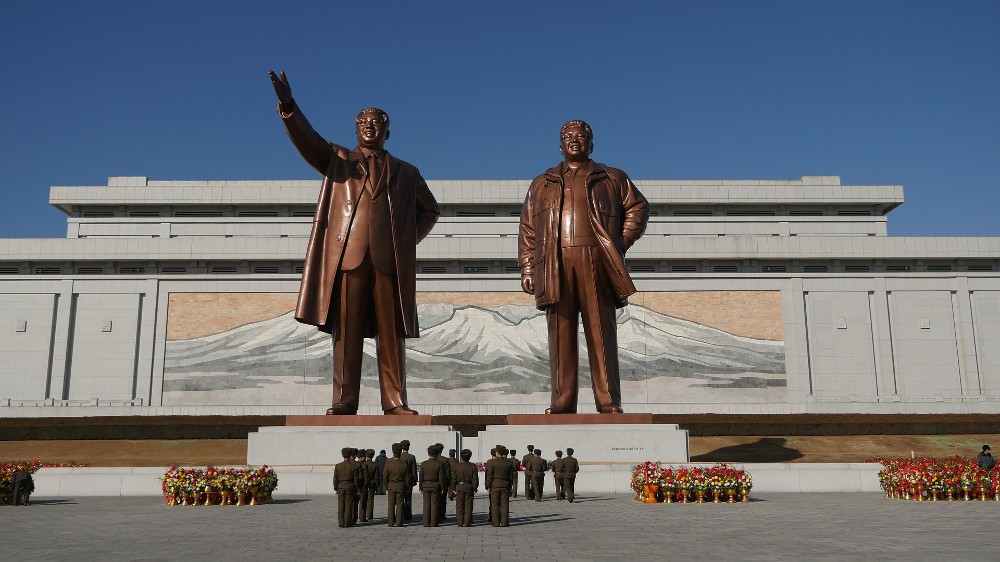

As a species, we try to come up with tools that make up for our own inability to master our environment and our society. We can't implement a perfect democracy, for example. We can't produce our own energy without digging fossilized organic material. I'm always fascinated by these tools, as I believe they contain everything that makes us thinking machines.

<!-- end -->

## Bitcoin

One of these tools, in my view, is blockchain. However, the fact that Bitcoin was developed to solve a money problem, that touched something that is close to most people. People care about money, they'd do the nastiest things to earn it, keep it, invest it.

This made people also quite conservative and reject change. They don't want to risk losing their money! Because of this. it's becoming more and more difficult to update the Bitcoin protocol to be what it is intended to be: an electronic cash system. However, it became a first project of a bigger set of tools that we, blockchain developers, are developing.

## Money, money, money

Being something that everyone wants, money is also the most well-guarded thing. Bitcoin is a system that everyone can _trust to be trustless_, as it feeds on people trying to compete and game the system. In another words, the more you try to attack Bitcoin, the more resilient it becomes. That's the magic of blockchain, and I'd be happy to help whoever wants to know more details about how it does that.

Smart people thought "if money is the most wanted thing and this system feeds on lack of trust, isn't it perfect for so much more?". Turns out they were right, it is! The idea of trusting any piece of information to a system that feeds on the attempts of others to steal it, is basically the closest you become to trusting in something that represents the truth. In other words, truth is exactly what is left from a technology that feeds on profound lack of trust. I'll provide you an example below, but first let me talk about contracts.

## Code is law

Second generation blockchains came in, like Ethereum. They used a different approach to blockchain in some ways, and allowed transactions to contain little rules (called contracts) on what would happen if some information (or money) arrived to them. For example, I could send a certain amount of cash to one contract, and it would split it evenly between my little kids. These contracts are stored in a range of computers that are actively competing to win a specific reward. This competition ensures that contracts are exactly the same in each computer, and they agree on what's the global, correct and inviolable state.

So with Bitcoin, you can transact and store money without fear that someone with a higher authority may seize it. With Ethereum, the same happens with any sort of information. Whatever you send to a contract is processed and stored forever in thousands of computers and will, reliably, **never** be lost or tampered with.

## An exercise

Let's say that your country suffers a coup attempt. Some radical movement (like in _The Handmaid's Tale_) storms your government data centers, and decides that whatever property you had it's not yours anymore. They grab the paper that say that your house is yours, burn it, and say "it's ours now". Let's say that the coup fails and democracy is replenished: how do we return the houses to their owners?

You can say this situation is dramatic, but it's a reality in a lot of countries, where authoritarian regimes seized property, and governments no longer hold truthful information on what actually is the house you built and paid for.

However, if this kind of information was actually stored on a contract, it wouldn't be lost forever. The radical movement could chose to ignore it, but somewhere in the world there would be thousands of computers that say "I have that original information, and I couldn't change it even if I wanted to". 

## How far can we go?

We don't know yet. Blockchain development is in it's early days, and the _unknown unknown_ (the things that we don't even know that we don't know) about it is huge. Projects are born and die every day, new ideas come up, changes are made, etc.

In the next blog posts I'll talk more about blockchain, and how it changed my life. I can go into details on how it works, I can dissect some projects and point their strengths and weaknesses, I can even try to dwell a bit on the financial side of this technology.

However, this simple example I described above is enough for me to decide to spend more and more time of my life developing this kind of system. It is a human tool to cope with our own human nature and the defects of our society. It is a technology that will make the world a better place for my little kids, so that's the world I want to leave behind for them.
